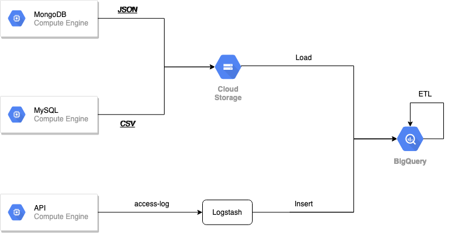

# ETL 數據整合解決方案

### 概念

數據應用的前後端開發，不論最後打造出的使用者服務為何，不論採用的技術是動態即時分析 (OLAP)、資料探勘 (Data Mining) 等，不論其資料架構為資料湖泊 (Data Lake)、資料倉儲 (Data Warehouse) 或是更多，其整體架構之最底層皆為資料整合 (ETL) 的機制。

本解決方案旨在示範如何使用 Google Cloud 進行資料整合的最小可行性產品 (Minimum Viable Product) ，藉此展現資料整合的概念，如果需要 production-ready 的完整解決方案，請來信諮詢。


## 用資料說故事

在數據時代之前，企業往往仰賴領域專家的知識，領域專家的知識固然重要，但是輔以數據進行說明才更能說服群眾。此外，足夠大量的資料往往能夠洞察到領域專家也不一定知道的事情，例如*啤酒尿布*即是透過觀察結帳數據才發現：啤酒、尿布常會一起被購買是因為丈夫在買了尿布之後，順便買啤酒的關係。

由上案例我們能夠知道：足夠大量並且完整的資料，可以清晰描述出客戶的購物旅程，完整的客戶旅程則能夠協助說明許多過去無法解釋的現象，進一步針對現象進行適當的商品調整。


## 困難點

### 異源資料

在實務中，針對不同的應用場景和性質選擇最適合的數據儲存體是常見且非常合理的做法。

- **關聯式資料庫 (RDB, Relational Database)**

  主要是以資料表 (Table) 呈現並且需要預先定義 schema 來確定這張資料表將會儲存多少不同類型的欄位 (column)，而每個資料實體 (entity) 則是以列 (row) 表示。每張資料表通常會定義一個欄位來做為主索引鍵 (primary key)，多個資料表之間亦可透過外部索引鍵 (foreign key) 建立關聯。

  > 交易型的資料通常會選擇關聯式資料庫進行儲存，常見的有 MySQL, PostgreSQL, Oracle, MS SQL......

- **NoSQL (Not Only SQL) 資料庫** 大部分都支援 Schema-free 或半結構化 (semi-structured) 兩種資料結構，通常不保證 ACID (atomicity 原子性、consistency 一致性、isolation 隔離性、durability 持久性)，也不強調資料表之間的關聯 (甚至沒有資料表的概念，例如 key-value 型式的 Redis)，在架構上也通常是分散式系統。

  > 在資料量龐大並且需要 schema free 或特別重視擴展性 (scability)  的應用場景則通常會選用 NoSQL 資料庫，常見的有 MongoDb, Redis, Elasticsearch, Hadoop, Cassandra

### 未考慮到資料整合的既有系統架構

資訊系統在建構的時候一定是伴隨對應的商業情境，針對不同情境解決不同問題或是針對商業需求帶來服務進而產生期望的商業價值。例如:

  - **電子商務**即是在處理商品銷售問題。針對買家提供一個瀏覽、選購商品的平台；針對賣家提供一個上架、成交、出貨的商品管理平台。
  - **數位媒體**即是在提供一個可以讓內容曝光的平台。針對讀者提供一個線上閱覽的平台；針對作者提供一個內容編輯的環境並且能夠上下架文章。

資訊系統在建構的時候首要目標即是在提供服務進而產生價值，對於後續的用戶或商品的資料分析是*重要但不緊急*，因此許多資訊系統不一定會在初期就把資料整合的功能放入系統設計的規格中。不幸的是，當資訊系統越長越大、日漸複雜之後再要實現資料整合的功能是越不容易的，因為資料已經散佈在不同的地方，並且也因為商業需求導致資料之間的邏輯變得複雜，導致企業無法一步到位的進行整合。


## 解決方案

> 本沙盒需要一個 Google Cloud Platform 專案

### 系統架構



### 啟用 API

透過下列網址 https://console.cloud.google.com/apis/library?q=google 前往開啟下列 API

* 啟用 [Cloud Shell API](https://console.cloud.google.com/apis/library/cloudshell.googleapis.com)
* 啟用 [Compute Engine API](https://console.cloud.google.com/apis/library/compute.googleapis.com)
* 啟用 [Cloud Storage API](https://console.cloud.google.com/apis/library/storage*component.googleapis.com)
* 啟用 [BigQuery API](https://console.cloud.google.com/apis/library/bigquery.googleapis.com)

### 啟動 ComputeEngine Instance

[使用 Cloud Shell](https://console.cloud.google.com/home/dashboard?cloudshell=true)

> 請確認專案名稱是否為您想進行沙盒的專案

以下範例為了環境便利將會以 Docker 來進行展示

```bash
# Define GCP_PROJECT
export GCP_PROJECT="your-project"

gcloud beta compute \
  instances create ikala-data-integration-sandbox \
  --zone=us-central1-a \
  --machine-type=n1-standard-2 \
  --subnet=default \
  --network-tier=PREMIUM \
  --maintenance-policy=MIGRATE \
  --tags=default-allow-ssh,default-allow-internal \
  --scopes=https://www.googleapis.com/auth/cloud-platform \
  --image-family=cos-stable \
  --image-project=cos-cloud \
  --boot-disk-size=100GB \
  --boot-disk-type=pd-standard \
  --boot-disk-device-name=ikala-data-integration-sandbox \
  --reservation-affinity=any \
  --project=${GCP_PROJECT}
```

### 建立 Google Cloud Storage Bucket

[使用 Cloud Shell](https://console.cloud.google.com/home/dashboard?cloudshell=true)

> 請確認專案名稱是否為您想進行沙盒的專案

```bash
# Define GCP_PROJECT
export GCP_PROJECT="your-project"

gsutil mb \
  -l asia-east1 \
  -p ${GCP_PROJECT} \
  gs://ikala-data-integration-sandbox-${GCP_PROJECT}
```

### 建立 BigQuery Dataset

[使用 Cloud Shell](https://console.cloud.google.com/home/dashboard?cloudshell=true)

> 請確認專案名稱是否為您想進行沙盒的專案

```bash
# Define GCP_PROJECT
export GCP_PROJECT="your-project"

# Create dataset
bq --project_id=${GCP_PROJECT} mk ikala_data_integration_sandbox
```

上述指令中，我們建立了: `ikala_data_integration_sandbox` 的 BigQuery 資料集 (Dataset)，並且在 `ikala_data_integration_sandbox` dataset 之下我們又建立了兩個 tables: `users` (用於儲存來自 MySQL 的資料)和 `products` (用於儲存來自 MongoDb 的資料)


### 在 ComputeEngine Instance 下載專案

使用 [WebSSH](https://cloud.google.com/compute/docs/ssh-in-browser) 連線至 GCE Instance 並執行指令

```bash
git clone https://github.com/iKala-Data-Lake/whitepaper-data-integration.git
```

上述指令將會把範例程式和資料下載到 GCE Instance 上


### 在 ComputeEngine Instance 上啟動 MySQL 容器

使用 [WebSSH](https://cloud.google.com/compute/docs/ssh-in-browser) 連線至 GCE Instance 並執行指令

```bash
# go to data-integration directory
cd whitepaper-data-integration

# define GCP-Project, Mysql container name
export MYSQL_CONTAINER_NAME="mysql_container"
export MYSQL_USER="root"
export MYSQL_PASSWORD="12345678"

# launch a mysql container in daemon (background) mode and give name: mysql_container
docker run \
  --name $MYSQL_CONTAINER_NAME \
  --detach \
  --volume `pwd`:/opt \
  --env MYSQL_ROOT_PASSWORD=${MYSQL_PASSWORD} \
  mysql:8 \
  --secure-file-priv=/opt

# import data into mysql container
docker exec -it $MYSQL_CONTAINER_NAME sh -c \
  'exec mysql -p mysql < /opt/sample-data/mysql.sql'
```

在上述指令中，我們首先在環境變數 (Environment Variables) 宣告了 MySQL Container 的名稱為: `mysql_container` 和帳號密碼 _(注意：本操作僅用作展示，在生產環境並不是最佳實踐)_ ，然後透過 `docker run` 指令啟動一個 MySQL 容器 (Container) 運行在背景，最後再藉由 `docker exec` 於容器中執行 SQL 腳本: __example.sql__ 將資料匯入


### 在 ComputeEngine Instance 上啟動 MongoDb 容器

使用 [WebSSH](https://cloud.google.com/compute/docs/ssh-in-browser) 連線至 GCE Instance 並執行指令

```bash
# go to data-integration directory
cd whitepaper-data-integration

# define GCP-Project, MongoDb container name
export MONGODB_CONTAINER_NAME="mongodb_container"
export MONGODB_USER="mongo"
export MONGODB_PASSWORD="12345678"

# launch a mongodb container in backgroup and give name: mongodb_container
docker run \
  --name $MONGODB_CONTAINER_NAME \
  --detach \
  --volume `pwd`:/opt \
  --env MONGO_INITDB_ROOT_USERNAME=${MONGODB_USER} \
  --env MONGO_INITDB_ROOT_PASSWORD=${MONGODB_PASSWORD} \
  mongo:3

# import data into mongodb
docker exec -it $MONGODB_CONTAINER_NAME sh -c \
  'mongoimport -u mongo -d example -c products --file=/opt/sample-data/mongo.json --jsonArray --authenticationDatabase=admin'
```

在上述指令中，我們首先在環境變數 (Environment Variables) 宣告了 MongoDb Container 的名稱為: `mongodb_container` 和帳號密碼 _(注意：本操作僅用作展示，在生產環境並不是最佳實踐)_ ，然後透過 `docker run` 指令啟動一個 MongoDb 容器 (Container) 運行在背景，最後再藉由 `docker exec` 指令於容器中執行 _mongoimport_ 指令將 __products.json__ 的資料匯入


### 在 ComputeEngine Instance 上啟動 API Server 容器

使用 [WebSSH](https://cloud.google.com/compute/docs/ssh-in-browser) 連線至 GCE Instance 並執行指令

```bash
# go to data-integration directory
cd whitepaper-data-integration

# define GCP-Project, Mysql container name
export API_CONTAINER_NAME="api_container"
export LOGSTASH_CONTAINER_NAME="logstash_container"

# build a API Server
docker build -t example-api src/server

# launch a API container in backgroup and give name: api_container
docker run \
  --name $API_CONTAINER_NAME \
  --detach \
  --publish 8080:8080 \
  --volume `pwd`/src/logs:/app/logs \
  --env MYSQL_CONTAINER_NAME=${MYSQL_CONTAINER_NAME} \
  --env MYSQL_USERNAME=${MYSQL_USER} \
  --env MYSQL_PASSWORD=${MYSQL_PASSWORD} \
  --env MONGODB_CONTAINER_NAME=${MONGODB_CONTAINER_NAME} \
  --env MONGO_USERNAME=${MONGODB_USER} \
  --env MONGO_PASSWORD=${MONGODB_PASSWORD} \
  --link ${MYSQL_CONTAINER_NAME} \
  --link ${MONGODB_CONTAINER_NAME} \
  example-api

# launch logstash container for pipe API server access-loog into bigquery
docker run \
  --name ${LOGSTASH_CONTAINER_NAME} \
  --detach \
  -v `pwd`/src/logstash-pipeline:/usr/share/logstash/pipeline \
  -v ${HOME}/.config/gcloud:/home/logstash/.config/gcloud \
  -v `pwd`/src/logstash-config/logstash.yml:/usr/share/logstash/config/logstash.yml \
  -v `pwd`/src/logs:/logs \
  docker.elastic.co/logstash/logstash:7.6.2 sh -c "logstash-plugin install logstash-output-google_bigquery && logstash"
```

在上述指令中，我們首先宣告了 API 容器和 Logstash 容器的名稱，然後使用 `docker build` 的指令建立 API Image；接著透過 `docker run` 的指令啟動剛剛建立的 API Image 和 Logstash

- 在啟動 API 容器的時候，我們除了把 port 8080 發布之外，我們也將 MongoDB 容器和 MySQL 容器與 API 容器連接在一起，並且也把 MongDb 和 Mysql 的帳號密碼以環境變數的形式傳遞進 API 容器。此外我們也將 API 容器輸出 __/app/logs__ 的資料夾與本地的 __src/logs__ 資料夾綁定
- 在啟動 Logstash 容器的時候，我們將 API 容器的 __/app/logs__ 透過本地的 __src/logs__ 綁在 Logstash 容器的 __/logs__，並且也把 GCE Instance 上的 __${HOME}/.config/gcloud__ 與 Logstash 容器的 __/home/logstash/.config/gcloud__ 綁在一起，使得 Logstash 容器具有 Instance 將同的 GCP 權限，這些權限將使 Logstash 容器可以把解析過後的資料直接輸入進 BigQuery 的 _ikala_data_integration_sandbox_ 資料集中

此段落展示了一種方法：透過 API 服務器被存取的記錄來追蹤用戶的行為軌跡。在現實環境中，用戶在前端(網站或 APP)瀏覽的頁面資訊皆是透過呼叫後端 API 服務器取得，因此若是對 API 服務器這些被存取的資料進行分析則可以間接了解用戶的操作習慣和偏好。目前除了此種追蹤用戶的方式之外，最普遍的是透過 __Pixel Tracking__ 的方式收集行為軌跡，此方式是透過在前端(網站或 APP)埋入追蹤碼並把要收集的用戶行為以 HTTP [Query string](https://en.wikipedia.org/wiki/Query_string)的形式回傳到後端主機中並解析。

> 延伸閱讀： [Google Cloud Solutions: Serverless Pixel Tracking Architecture](https://cloud.google.com/solutions/serverless-pixel-tracking)、[iKala User Tracking](https://ikala-data-lake.github.io/documentation/)

### 在 ComputeEngine Instance 上設定資料萃取

使用 [WebSSH](https://cloud.google.com/compute/docs/ssh-in-browser) 連線至 GCE Instance 並執行指令

在下列指令中，我們將會使用 Docker 建立一個資料萃取的執行環境把資料從 MySQL 和 MongoDb 取出並上傳到 Google Cloud Storage 中。

```bash
# go to data-integration directory
cd whitepaper-data-integration

# define GCP-Project, MongoDb container name
export MONGODB_CONTAINER_NAME="mongodb_container"
export MONGODB_USER="mongo"
export MONGODB_PASSWORD="12345678"

# define GCP-Project, Mysql container name
export MYSQL_CONTAINER_NAME="mysql_container"
export MYSQL_USER="root"
export MYSQL_PASSWORD="12345678"

# build cronjob runtime
docker build -t example-cronjob src/cronjob

# extract data from mysql
docker run -it \
  --rm \
  --volume ${HOME}/.config/gcloud:/root/.config/gcloud \
  --env GCP_PROJECT=${GCP_PROJECT} \
  --env MYSQL_CONTAINER_NAME=${MYSQL_CONTAINER_NAME} \
  --env MYSQL_USERNAME=${MYSQL_USER} \
  --env MYSQL_PASSWORD=${MYSQL_PASSWORD} \
  --env MONGODB_CONTAINER_NAME=${MONGODB_CONTAINER_NAME} \
  --env MONGO_USERNAME=${MONGODB_USER} \
  --env MONGO_PASSWORD=${MONGODB_PASSWORD} \
  --link ${MYSQL_CONTAINER_NAME} \
  --link ${MONGODB_CONTAINER_NAME} \
  example-cronjob mysql

# extract data from mongo
docker run -it \
  --rm \
  --volume ${HOME}/.config/gcloud:/root/.config/gcloud \
  --env GCP_PROJECT=${GCP_PROJECT} \
  --env MYSQL_CONTAINER_NAME=${MYSQL_CONTAINER_NAME} \
  --env MYSQL_USERNAME=${MYSQL_USER} \
  --env MYSQL_PASSWORD=${MYSQL_PASSWORD} \
  --env MONGODB_CONTAINER_NAME=${MONGODB_CONTAINER_NAME} \
  --env MONGO_USERNAME=${MONGODB_USER} \
  --env MONGO_PASSWORD=${MONGODB_PASSWORD} \
  --link ${MYSQL_CONTAINER_NAME} \
  --link ${MONGODB_CONTAINER_NAME} \
  example-cronjob mongo
```

在 `docker build ...` 中，我們使用 `src/cronjob/Dockerfile` 檔案建立一個 Python 的執行環境並安裝了 MySQL 和 MongoDb 的連接器 (connector): `PyMySQL` 和 `pymongo`，並且將 `src/cronjob/dump.py` 當作 docker image 的入口點 (entrypoint)

在 `docker run -it ...` 的時候，我們把使用者的 `${HOME}/.config/gcloud` 掛載到容器的 `/root/.config/gcloud` 此舉是為了讓容器在執行的時候具有 gcloud 的權限，而該權限則是來自 GCE Instance 上的 credentials (若不是 GCE Instance 的話則要另外產生 access-key 並下載，請參考[官方文件](https://cloud.google.com/iam/docs/creating-managing-service-account-keys))

在 `src/cronjob/dump.py` 中預設了兩個指令: mongo 和 mysql 分別對應到 MySQL 和 MongoDb 簡易的資料萃取邏輯: 連接資料庫、擷取資料、轉換為 [JSON Lines](http://jsonlines.org/) 格式、上傳到 GCS Bucket。

> 轉換為 JSON Lines 格式是為了方便後續的 [Loading JSON into BigQuery](https://cloud.google.com/bigquery/docs/loading-data-cloud-storage-json)

### 資料載入

[使用 Cloud Shell](https://console.cloud.google.com/home/dashboard?cloudshell=true)

> 請確認專案名稱是否為您想進行沙盒的專案

在此段落，我們將會 Bucket 中的資料載入到 BigQuery

```bash
# Define GCP_PROJECT
export GCP_PROJECT="your-project"

# load mongo
bq --project_id=${GCP_PROJECT} \
  load \
  --source_format=NEWLINE_DELIMITED_JSON \
  --autodetect \
  --replace \
  ikala_data_integration_sandbox.products \
  gs://ikala-data-integration-sandbox-${GCP_PROJECT}/mongo/example-products.jsonl

# load mysql
bq --project_id=${GCP_PROJECT} \
  load \
  --source_format=NEWLINE_DELIMITED_JSON \
  --autodetect \
  --replace \
  ikala_data_integration_sandbox.orders \
  gs://ikala-data-integration-sandbox-${GCP_PROJECT}/mysql/example-orders.jsonl
```

### 資料轉換

[使用 Cloud Shell](https://console.cloud.google.com/home/dashboard?cloudshell=true)

> 請確認專案名稱是否為您想進行沙盒的專案

在此段落，我們將會一次性的把 __products__ 和 __orders__ 兩張資料表合併成一張寬表。

```bash
# Define GCP_PROJECT
export GCP_PROJECT="your-project"

cat src/etl/etl.sql | bq --project_id=${GCP_PROJECT} \
  query \
  --replace \
  --use_legacy_sql=false \
  --destination_table ikala_data_integration_sandbox.full_orders
```

- etl.sql

  ```sql
  SELECT
    orders.user_id,
    orders.order_id,
    orders.order_date,
    orders.product_id,
    orders.option_id,
    flat_products.* EXCEPT(product_id, option_id),
    orders.* EXCEPT(user_id, order_id, product_id, option_id, order_date)
  FROM (
      -- flatten products.OPTIONS
      SELECT
        products.id AS product_id,
        products.name AS product_name,
        products.descriptions AS product_descriptions,
        category.id AS category_id,
        category.name AS category_name,
        vendor.id AS vendor_id,
        vendor.name AS vendor_name,
        vendor.email AS vendor_email,
        vendor.phone AS vendor_phone,
        OPTIONS.id AS option_id,
        OPTIONS.name AS option_name,
        OPTIONS.quantity AS option_quantity,
        OPTIONS.on_sale AS option_on_sale,
        OPTIONS.price AS option_price,
        OPTIONS.specs AS option_specs
      FROM ikala_data_integration_sandbox.products, products.OPTIONS
    ) flat_products, ikala_data_integration_sandbox.orders 
  WHERE
    orders.product_id = flat_products.product_id AND orders.option_id = flat_products.option_id
  ORDER BY
    order_date DESC, user_id, order_id, product_id, option_id
  ```

### 小結

進行資料整合是有目的性的，例如: 想要建立 Data Lake, Data warehouse 或 Data Mart，在整合的過程可以分成 __一步到位__ 或 __階段性__：

- __一步到位__ 的好處是不會產生中繼或過渡資料，但是有可能需要停機，風險也較大
- __階段性__ 的好處則是可以逐步收斂資料使用的需求和場景，但是可能會產生較多的過渡資料，並且效能可以會受影響

企業在選擇整合方式的時候，可以基於實際的營運狀況和系統架構進行評估，並且視最終的資料使用場景進行優化。本沙盒展示的範例僅供參考，在實際的生產環境中，資料表之間的關聯和資料庫之間的相依會再更複雜，因為牽涉到商務邏輯，如何做到 zero-downtime 或不影響實際服務效能的資料整合則是需要許多職能間的互相配合和選擇適當的工具。

## 後續應用

在完成了資料整合暨用戶分析之後，企業對於用戶應該會有更深入的了解和更清楚營運現況，為了改善現況或增加更多的營收則可以藉由數位行銷來進行，例如投放廣告吸引來客、設計折扣增加轉換率、對舊客投放可能感興趣的商品清單......，並且，為了避免漫無目的的投放而產生擾客造成流失則可以藉由機器學習來 __輔助__ 用戶終身價值的計算、名單的篩選、用戶輪廓的建立、商品推薦篩選......

### 探索式分析

企業基於自己的商業模式 (Business Model) 建構資訊系統，資訊系統中通常有用戶資訊、商品資訊、訂單，
並且資料隨著營運時間也跟著增長。對企業來說這些資料是重要的，代表著營運狀況、用戶與商品之間的關聯性......，
常見的分析有：

- 營運分析

  基於總體銷售的目的進行分析，希望能夠了解用戶如何到站、用戶旅程、地理分佈、網站使用體驗

- 用戶輪廓

  基於商品種類或品項的目的進行用戶探索，希望能夠更了解在不同的時期對相同品項感興趣的用戶，其屬性是什麼？是否有改變？

  例如分析結果可能會是以下：對 3C 種類中的 __專業攝影機__ 品項感興趣的用戶在 2020/01/01 到 2020/03/31 這個區間
    - 通常也對記憶卡、Macbook 感興趣
    - 通常是已婚並育有子女的男性，年齡在 35 到 50 歲之間
    - 工作日的到站時段通常是早上七點半到八點半和晚上十一點到凌晨一點
    - 會產生交易的時段則不定，但是通常發生時間在 1 到 2 月。

### 數位行銷

除了在廣告聯播網上進行大面積的廣告投放之外，也應該從用戶經營的角度進行更近距離的行銷以增加品牌忠誠度，例如透過社群小編強化品牌聲量和形象、藉由官方帳號直接進行更多的個人化行銷。

### 機器學習

通常由於商品數和用戶數龐大的關係，__人__ 較難針對每位用戶建立可能感興趣的商品清單或，建立用戶之間，商品之間和用戶與商品之間的關聯，這時候可以考慮透過 __機器學習__ 的方法從過去的用戶和商品之間的行為關係進行 _模式學習_ 而達到以上目的。
